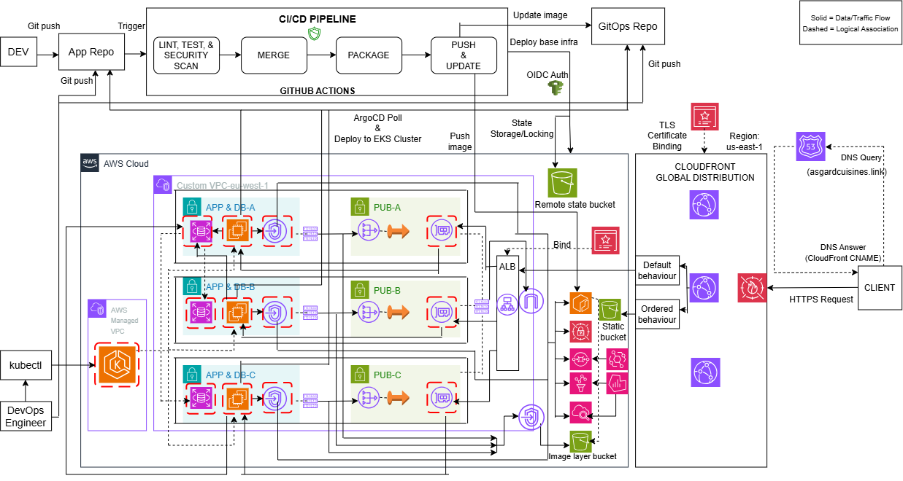
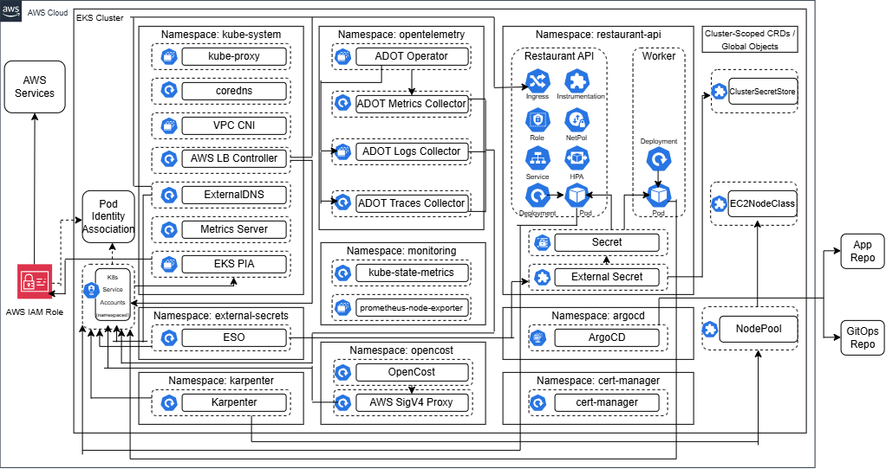

**Production-Grade Kubernetes Orchestration & Observability**  
A resilient, secure, production-grade, cloud-native Kubernetes deployment on AWS, orchestrated using Terraform, GitHub Actions, and ArgoCD. This is version 4 of a continuously evolving cloud-native system. Version 1 was the local Docker Compose deployment, version 2 was the local Kubernetes deployment with observability, and version 3 was the production-grade serverless deployment.

**Project Scope**  
This project focuses on automated deployment of a production-grade, zero-trust AWS EKS Kubernetes infrastructure using Terraform, GitHub Actions, and ArgoCD for declarative GitOps continuous delivery. It enforces an enterprise security posture through a 4-stage DevSecOps pipeline (Checkov, Bandit, Snyk, Trivy, and Nuclei DAST), keyless OIDC authentication, EKS Pod Identity, and External Secrets Operator (ESO). To ensure scalability, resilience, and operational efficiency, the platform integrates Karpenter for dynamic, just-in-time EC2 node autoscaling, OpenCost for FinOps cost monitoring, and a 3-pillar observability architecture powered by AWS Distro for OpenTelemetry (ADOT), Amazon Managed Service for Prometheus (AMP), Grafana, AWS X-Ray, and CloudWatch.

**Installation & Setup**  
Follow these steps to bootstrap the Zero-Trust OIDC identity layer, provision the production-grade EKS base infrastructure using Terraform and GitHub Actions, and deploy the platform controllers and application using ArgoCD.  

 1. Prerequisites  
  - AWS Account: An active AWS account with permissions to provision VPCs, EKS, ALB, RDS, SQS, S3, IAM roles, etc.  
  - AWS IAM Identity Center: Ensure the IAM Identity Center is enabled in the AWS account for the Grafana workspace.  
  - Domain Name: An active domain name (asgardcuisines.link).
  - GitHub Account: For hosting the repository and executing the EKS CI/CD workflows.  
  - Terraform CLI: Installed locally to execute the initial local bootstrap phase.   
  - AWS CLI & Kubectl: Installed locally to connect to and manage the remote EKS cluster.  

 2. Repository Setup  
  This project uses a dual-repo structure: App repo and [GitOps repo](https://github.com/ChukaOkeke/restaurant-api-eks-gitops). Clone the app repository containing the source code, Helm templates, and base infra configuration to your local machine:

```bash  
git clone https://github.com/ChukaOkeke/restaurant-api-eks.git
cd restaurant-api-eks  
```

 3. Local Bootstrap  
  Before GitHub Actions can authenticate to your AWS account without static access keys, you must manually seed the OIDC identity provider and deployment role from your local machine. Navigate to your infrastructure directory, initialize Terraform, and target only the identity components:    

```bash  
cd infrastructure
terraform init

# Target the security module/resources to bootstrap the OIDC trust relationship
terraform apply --auto-approve \
  -target=module.security.aws_iam_openid_connect_provider.github \
  -target=module.security.aws_iam_role.github_actions \
  -target=module.security.aws_iam_role_policy_attachment.terraform_admin
``` 

  Architectural Note: Once this bootstrap command completes successfully, AWS will officially trust your specified GitHub repository, allowing you to hand off all subsequent base infrastructure management to the automated CI/CD pipeline.  

 4. GitHub Secrets Configuration  
  This EKS pipeline utilizes keyless federation but requires a baseline environment configuration to target your specific AWS base.  
  - Navigate to your repository on GitHub.  
  - Go to Settings > Secrets and variables > Actions.  
  - Under Repository Secrets, click New repository secret and add the following variables:  
    -> AWS_ACCOUNT_ID: Your 12-digit AWS Account Number (required to dynamically construct the OIDC Role ARN within the workflow runner).  
    -> SNYK_TOKEN: Your Snyk token required to dynamically interact with Snyk for SCA within the workflow runner.  
    -> GITOPS_PAT: Your GitHub token required to dynamically update the GitOps repo.  

 5. Deployment Lifecycle  
   With the trust boundary verified and the environment secrets mapped, the infrastructure and code integration and deployment lifecycle is fully automated.  
   - Trigger the Pipeline: Push your codebase changes or infrastructure updates to a feature branch and open a pull request on GitHub:  

```bash  
git add .
git commit -m "feat: deploy production EKS platform v3"
git push origin feature/modify-eks-config
``` 
   - Monitor Pipeline Progress: Open the Actions tab in your GitHub repository. The runner will execute the integration phase, and the deployment phase after merging the pull request:  
     -> Phase 1 (Linting, Testing, and Security Scans): Validates the app & infrastructure code syntax, runs pytest, and scans the app & infrastructure code for vulnerabilities and misconfigurations with Bandit, Snyk, and Checkov.   
     -> Phase 2 (Infrastructure Deployment, Image Build, & Image Tag Update): Validates code configurations via Pre-Deploy SAST, provisions base infra, EKS cluster, EKS add-ons, & ArgoCD, builds Docker image, scans image & container with Trivy and Nuclei, and updates Helm values in the GitOps repo.  
   - Activate GitOps: Clone the GitOps repository containing the ArgoCD Apps, platform controllers, and Helm values. Bootstrap the Root ArgoCD App to trigger ArgoCD to deploy the platform controllers and application to the cluster. Execute the following commands outside the app repo    

```bash  
git clone https://github.com/ChukaOkeke/restaurant-api-eks-gitops.git
cd restaurant-api-eks-gitops
aws eks update-kubeconfig --region eu-west-1 --name restaurant-api-eks
kubectl apply -f bootstrap/root-app.yaml
```


 6. Access the Application  
 The application will be available at http://asgardcuisines.link.  

**API Endpoints**  
The API supports the following endpoints for managing menu items and table bookings.

### API Endpoints

| **Method** | **Endpoint** | **Description** | **Authentication** |
| :--- | :--- | :--- | :--- |
| `GET` | `/api/` | Home Page | Public |
| `GET` | `/api/menu-items/` | List all menu items | Public |
| `POST` | `/api/menu-items/` | Create a new menu item | Admin Only |
| `GET` | `/api/menu-items/<id>/` | Get details of a specific item | Public |
| `PUT/PATCH` | `/api/menu-items/<id>/` | Update a menu item | Admin Only |
| `DELETE` | `/api/menu-items/<id>/` | Remove an item | Admin Only |
| `GET` | `/api/booking/tables/` | View all active bookings | Authenticated |
| `POST` | `/api/booking/tables/` | Create a new table reservation | Authenticated |
| `DELETE` | `/api/booking/tables/<id>/` | Cancel a reservation | Owner/Staff |
| `GET` | `/auth/users/` | List all registered users | Admin Only |
| `POST` | `/auth/users/` | Register a new user | Public |
| `POST` | `/auth/token/login` | Generate an auth token for session access | Public |
| `POST` | `/auth/users/logout` | Logout the user | Public |


**1. Problem & Non-Functional Requirements (NFRs)**  
 **Problem Statement**  
 The goal was to automate the deployment of a cloud-native EKS platform, with drift detection, cost-optimized autoscaling, and full-stack observability.  

 **Key Features & Non-Functional Requirements**  
 - Reliability: The system should be regionally resilient.  
 - Scalability: The system should cope with varying load.  
 - Security: The system should have a robust zero-trust security posture.  
 - Cost Optimization: The system should be cost-optimized through right-sizing and cost-effective solutions.  
 - Performance: The system should exhibit low latency.  
 - Maintainability: The codebase should be clean and modular to make it easier to develop and maintain.  


**2. Architecture Overview**  
The architecture is designed to decouple the deployment engine from the target infrastructure, ensuring a secure and scalable lifecycle.  

 **System Architecture Diagram**  
 **Macro Cloud Architecture**

  

 **Micro EKS Cluster Architecture**

   


**Trust boundaries**  
 **TB1: GitHub Actions -> AWS (OIDC Federation)**: Keyless, short-lived session tokens eliminate static credentials, restricted strictly to the designated repository and production branch.  

 **TB2: Terraform -> Remote State (Encryption & Locking)**: State metadata is isolated in a private, encrypted S3 bucket and protected from concurrent pipeline modification via native state locking.  

 **TB3: Client Ingress -> CloudFront, WAF & ALB**: Edge-layer rate limiting and OWASP protection filter malicious traffic.  

 **TB4: EKS Compute -> RDS & Secrets**: EKS cluster and databases are isolated within a private, multi-AZ VPC, communicating securely via dynamic AWS Secrets Manager injection over private endpoints.  


**3. Key Design Decisions**  
 - Selected Terraform over manual config to ensure the cloud environment is versioned and reproducible.
 - Used AWS EKS for container orchestration to eliminate the overhead of configuring the Kubernetes control plane.
 - Implemented OIDC to harden the security posture by removing the need for long-lived IAM keys.  
 - Integrated SAST, SCA, Container Image Scanning, and DAST into the automated pipeline to identify and prevent app vulnerabilities and infra misconfigurations.  
 - Utilized GitHub Actions over Jenkins to reduce the operational overhead of the deployment automation.
 - Opted for ArgoCD over GitHub Actions for the application CD to detect drifts and enhance security.
 - Used Helm to package the application into a chart to streamline deployment.
 - Utilized a multi-stage Docker image build to reduce the image size and deployment time.
 - Implemented an SQS queue to decouple the booking intake from the database write.
 - Deployed a CloudFront distribution to improve the application's performance.
 - Selected VPC Endpoints over NAT Gateway to securely and cost-effectively enable the private VPC resources, like the EKS cluster, to interact with AWS public zone services (Secrets Manager, ECR, SQS, S3, AMP, CloudWatch) without transiting the public internet.
 - Utilized EKS Pod Identity over IRSA to minimize the overhead of enabling K8s workloads to interact with AWS services.  
 - Leveraged AWS Secrets Manager to securely manage sensitive data like Django secret key and database credentials, and used External Secrets Operator (ESO) to sync the secrets to the cluster. 
 - Deployed WAF to protect the application against DDoS attacks.
 - Provisioned a TLS certificate using ACM and associated it with the CloudFront distribution and ALB to encrypt the HTTP traffic. 
 - Selected Karpenter over the classic Cluster Autoscaler for just-in-time right-sized node provisioning and workload consolidation to optimize cost.
 - Implemented 3-pillar observability using OpenTelemetry (ADOT), Prometheus, Grafana, CloudWatch Logs, and AWS X-Ray for complete system visibility to enhance troubleshooting.


**4. Implementation**  
 I utilized Terraform (using Anton Babenko's modular patterns) to manage the deployment of the AWS base infra, EKS cluster, EKS add-ons, and ArgoCD. Used GitHub Actions as the secure CI/CD engine to automate the deployment, integrating SAST, SCA, Container Security, & DAST, and utilizing OIDC for secure, keyless authentication to AWS. Implemented GitOps with ArgoCD to manage the in-cluster runtime environment -- deploying the platform controllers and application to the EKS cluster.


**5. Security**  
 - **OIDC Identity Federation**: Used OIDC for short-lived session tokens.
 - **Secrets Management**: Selected AWS Secrets Manager to handle the Django secret key and database credentials securely. Used External Secrets Operator (ESO) to pull the secrets into the EKS cluster. Utilized GitHub Secrets to handle Snyk's authentication token securely.
 - **Network Hardening**: Deployed VPC Endpoints for private traffic routing. Implemented AWS Security Groups and K8s Network Policies to restrict traffic.
 - **Identity Security**: Used AWS IAM and K8s RBAC to enforce the least-privilege principle on resources and services. 
 - **Static Analysis (SAST)**: Performed automated security scans using Bandit and Checkov to identify vulnerabilites and misconfigurations. 
 - **Software Composition Analysis (SCA)**: Integrated Snyk into the automated pipeline to perform security scans on the application dependencies.
 - **Container Image Security**: Integrated Trivy into the automated pipeline to analyze the Docker image.
 - **Dynamic Analysis (DAST)**: Integrated Nuclei into the automated pipeline to analyze the container's security at runtime.
 - **Network Traffic Encryption**: Provisioned TLS certificates with ACM and applied them to the CloudFront distribution and ALB to encrypt the HTTP traffic.
 - **Application-Layer Filtering**: Deployed AWS WAF on the CloudFront distribution to protect the application from OWASP Top 10 exploits.
 - **Pod Security Context**: Enforced that the application pod and container run only as a non-root user to minimize exploits in the event of a successful hijack.


**6. Operations**  
**Autoscaling**  
Implemented Horizontal Pod Autoscaler (HPA) for pod autoscaling and Karpenter for just-in-time right-sized node autoscaling. Integrated an EC2 spot instance Node Pool and an interruption queue to optimize scaling cost.

**Observability**   
Implemented full-stack observability using OpenTelemetry (ADOT) to collect metrics, logs, and traces from the application and exporting to Prometheus (AMP), CloudWatch Logs, and AWS X-Ray. Used Grafana (AMG) to visualize the observability data in a unified dashboard. The unified dashboard as code is located at ./infrastructure/modules/observability/dashboards/eks-unified-dashboard.json.  


**Tech Stack**  
 - Cloud - **AWS**
 - Infrastructure as Code: **Terraform**
 - Containers & Orchestration: **Kubernetes (EKS), Karpenter, Helm, Docker** 
 - CI/CD: **GitHub Actions, ArgoCD**
 - Observability: **OpenTelemetry, Prometheus, Grafana, CloudWatch, AWS X-Ray**
 - Scripting/Programming: **Python, Bash**
 - Security: **Bandit, Checkov, Snyk, Trivy, Nuclei**


**Deep Dive & Demo**  
This project focuses on automated deployment of a production-grade, zero-trust AWS EKS platform, with cost-optimized autoscaling and full-stack observability. A detailed breakdown of the architectural decisions, design trade-offs, security boundaries, operational excellence, and lessons learned during the project is documented here on [From K8s to EKS: Production-Grade Cloud-Native Orchestration and Observability](https://medium.com/@chukaokeke/from-k8s-to-eks-production-grade-cloud-native-orchestration-and-observability-f5fa5d86509e).  
Demos can be found here on [EKS Deployment Automation & Rollout demo](https://youtu.be/-I0RJa-OuJk) and [EKS Autoscaling with HPA and Karpenter demo](https://youtu.be/UPbe01UizSQ)


